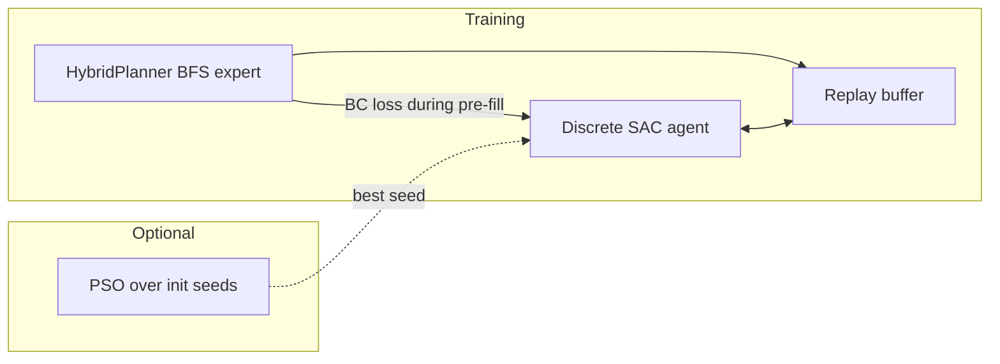
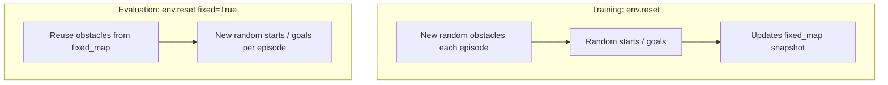
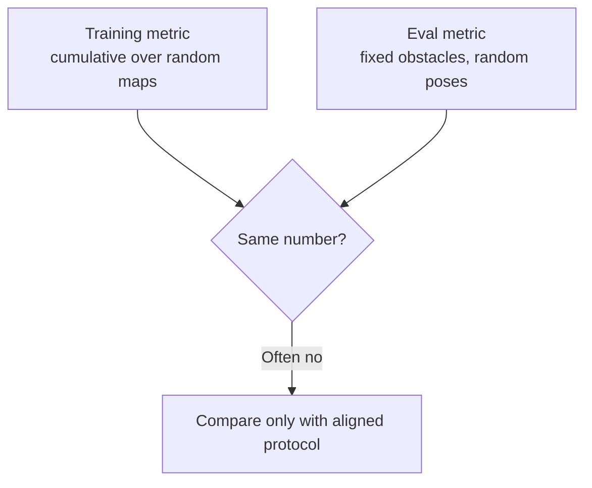
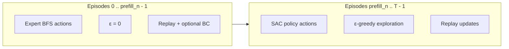
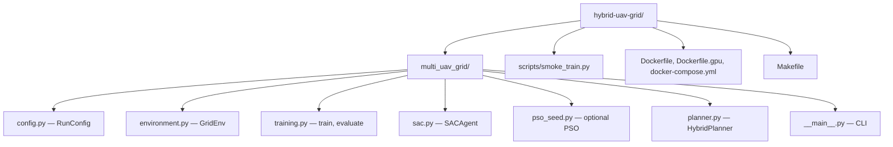
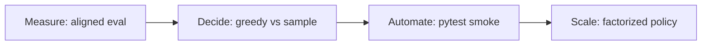

# Testing summary — hybrid-uav-grid

This document records **validation runs** performed on the `hybrid-uav-grid` package (multi-UAV grid world with **expert pre-fill**, **discrete SAC**, optional **PSO** over init seeds). It points to **log files**, **code paths**, and **how to reproduce** each check.

**Log files** live under [`logs/`](logs/) — see [`logs/README.md`](logs/README.md) for the directory layout (`smoke/`, `benchmarks/`, `archive/`).

For install and day-to-day usage, see the main [`README.md`](README.md).

---

## 1. What the stack does (quick reference)



- **Expert pre-fill:** First *N* episodes use `HybridPlanner` (BFS); transitions go to replay; auxiliary behavior-cloning step on the policy (`expert_bc_weight`) while the buffer is warm.
- **SAC phase:** After pre-fill, actions come from the policy with **ε-greedy** exploration (ε is **zero** during expert episodes so the buffer stays clean).
- **Effective pre-fill:** `min(expert_prefill_episodes, max(0, train_episodes - 100))` — see [`multi_uav_grid/training.py`](multi_uav_grid/training.py) (`_effective_prefill`). Short runs can end up with **no** expert episodes.

---

## 2. Train vs evaluation protocol (why numbers can disagree)

Training and evaluation do **not** draw from the same distribution of worlds.



Implementation: [`multi_uav_grid/environment.py`](multi_uav_grid/environment.py) — `reset(fixed=False)` vs `reset(fixed=True)`; evaluation calls the latter from [`multi_uav_grid/training.py`](multi_uav_grid/training.py) (`evaluate`).

**Implication:** High **cumulative training success** (many random maps) can coexist with **low eval success** on a **single held-out obstacle layout** (and new poses each test episode). Default eval uses **stochastic** policy sampling (`eval_deterministic=False`); `--eval-greedy` switches to argmax.

---

## 3. Test runs performed

### 3.1 Compile and import smoke

| Step | Command / artifact | Purpose |
|------|-------------------|---------|
| Bytecode check | `python3 -m py_compile multi_uav_grid/*.py` | Catch syntax errors in all package modules |
| Programmatic smoke | [`scripts/smoke_train.py`](scripts/smoke_train.py) | Minimal `train()` + `evaluate()` on CPU; adds project root to `sys.path` so it runs without `pip install -e .` |

**Log:** [`logs/smoke/test_smoke_and_quick.log`](logs/smoke/test_smoke_and_quick.log) — includes `py_compile`, smoke script (expects final line `smoke_import_train_eval_ok`), and a short CLI run.

**Older partial log:** [`logs/smoke/test_smoke_import.log`](logs/smoke/test_smoke_import.log) — from an earlier attempt (heredoc typo); kept for history if present.

---

### 3.2 Short CLI run (Makefile equivalent)

| Setting | Value |
|---------|--------|
| Train episodes | 20 |
| Test episodes | 10 |
| Seed | 99 |
| Log interval | every 5 episodes |

Equivalent Makefile target: `make run-smoke` → `python3 -m multi_uav_grid --train-episodes 20 --test-episodes 10 --log-every 5`.

**Expected behavior:** With only 20 training episodes, **effective expert pre-fill is 0** (`train_episodes - 100` caps prefill). The run is a sanity check for the CLI and logging, **not** a success-rate benchmark.

**Log:** same [`logs/smoke/test_smoke_and_quick.log`](logs/smoke/test_smoke_and_quick.log).

---

### 3.3 Benchmark A — seed 42

| Setting | Value |
|---------|--------|
| Train / test | 400 / 80 |
| Seed | 42 |
| PSO | off (default) |

**Observed (rerun):** cumulative training success **~74.75%**; eval **0%** (80 episodes).

| Log file | Notes |
|----------|--------|
| [`logs/benchmarks/test_run_seed42_rerun.log`](logs/benchmarks/test_run_seed42_rerun.log) | Current rerun |
| [`logs/archive/test_run_seed42.log`](logs/archive/test_run_seed42.log) | Earlier run (same settings class) |

---

### 3.4 Benchmark B — seed 7

| Setting | Value |
|---------|--------|
| Train / test | 800 / 100 |
| Seed | 7 |
| PSO | off |

**Observed (rerun):** cumulative training success **~49.88%**; eval **0%** (100 episodes). Runtime on reference machine ~3 minutes CPU (log timestamps vary by hardware).

| Log file | Notes |
|----------|--------|
| [`logs/benchmarks/test_run_seed7_rerun.log`](logs/benchmarks/test_run_seed7_rerun.log) | Current rerun |
| [`logs/archive/test_run_seed7.log`](logs/archive/test_run_seed7.log) | Earlier long run |

---

## 4. Test results (consolidated)

All figures below come from the **rerun** logs in this repo unless noted. Environment: **CPU** reference run (wall time varies by machine).

### 4.1 Summary table

| Run ID | Log file | Train ep. | Test ep. | Seed | Effective prefill | Final train success | Final eval success | Notes |
|--------|----------|-----------|----------|------|-------------------|---------------------|--------------------|--------|
| Smoke + compile | [`logs/smoke/test_smoke_and_quick.log`](logs/smoke/test_smoke_and_quick.log) | — | — | — | — | — | — | `py_compile` + script; see below |
| Short CLI | same | 20 | 10 | 99 | **0** | 0% (0/20) | 0% (0/10) | No expert phase |
| Benchmark A | [`logs/benchmarks/test_run_seed42_rerun.log`](logs/benchmarks/test_run_seed42_rerun.log) | 400 | 80 | 42 | **300** | **74.75%** (299/400) | **0%** (0/80) | Train rate drops after SAC phase |
| Benchmark B | [`logs/benchmarks/test_run_seed7_rerun.log`](logs/benchmarks/test_run_seed7_rerun.log) | 800 | 100 | 7 | **400** | **49.88%** (399/800) | **0%** (0/100) | Longer prefill; stronger late decay |

### 4.2 Smoke and short CLI (exact outcomes)

- **Compile:** `python3 -m py_compile multi_uav_grid/*.py` completed with exit code 0 (no output on success).
- **Script smoke:** prints `smoke_import_train_eval_ok` after 5 train / 3 test episodes (see [`scripts/smoke_train.py`](scripts/smoke_train.py)).
- **Short CLI (seed 99):** expert pre-fill **effective=0**; rolling train success **0%** through episode 20; eval **0/10**.

```text
# Excerpt: logs/smoke/test_smoke_and_quick.log (representative tail)
expert_prefill_episodes=400 (effective=0)
training finished success_rate=0.00% (0/20)
eval complete success_rate=0.00% (0/10)
```

### 4.3 Benchmark A — seed 42 (training curve + eval)

- **Prefill:** Episodes 1–280 logged at **100%** cumulative success; first dip **99.64%** at episode 280.
- **Post-expert:** Cumulative success falls to **74.75%** by episode 400 (pure SAC + exploration dominates the running average).
- **Eval:** **0 successes** in 80 episodes on the **fixed** obstacle layout with fresh starts/goals each episode.

```text
# Excerpt: logs/benchmarks/test_run_seed42_rerun.log
expert_prefill_episodes=400 (effective=300)
episode 280 success_rate=99.64%
episode 400 success_rate=74.75%
training finished success_rate=74.75% (299/400)
eval complete success_rate=0.00% (0/80)
```

### 4.4 Benchmark B — seed 7 (training curve + eval)

- **Prefill-heavy:** Stays **≥99.5%** through episode 400, then declines as SAC-only episodes accumulate.
- **Final train:** **49.88%** (399/800) — lower than Benchmark A partly because **more** episodes are SAC-only (400 vs 100) and the running average weights failures longer.
- **Eval:** **0/100** successes under default **stochastic** test policy.

```text
# Excerpt: logs/benchmarks/test_run_seed7_rerun.log
expert_prefill_episodes=400 (effective=400)
episode 400 success_rate=99.75%
episode 800 success_rate=49.88%
training finished success_rate=49.88% (399/800)
eval complete success_rate=0.00% (0/100)
```

### 4.5 How to read “train success” vs “eval success”



Training success is a **running average over many layouts**; eval success is **one obstacle field** (from the last training reset) with **new** start/goal samples. Treat them as **different metrics** until the protocol is aligned (see §10).

---

## 5. Logs index

| File | Contents |
|------|----------|
| [`logs/smoke/test_smoke_and_quick.log`](logs/smoke/test_smoke_and_quick.log) | Smoke line, 20/10 CLI, seed 99 |
| [`logs/smoke/test_smoke_import.log`](logs/smoke/test_smoke_import.log) | Older compile/smoke attempt (may be incomplete); safe to delete |
| [`logs/benchmarks/test_run_seed42_rerun.log`](logs/benchmarks/test_run_seed42_rerun.log) | Full line-by-line log, 400/80, seed 42 |
| [`logs/benchmarks/test_run_seed7_rerun.log`](logs/benchmarks/test_run_seed7_rerun.log) | Full line-by-line log, 800/100, seed 7 |
| [`logs/archive/test_run_seed42.log`](logs/archive/test_run_seed42.log) | Earlier seed-42 benchmark (if present) |
| [`logs/archive/test_run_seed7.log`](logs/archive/test_run_seed7.log) | Earlier seed-7 benchmark (if present) |

To regenerate any log: use the commands in [§8](#8-reproduce-all-checks) and `tee` to a new filename (include **date or git SHA** in the name for traceability).

---

## 6. Training episode timeline (prefill vs SAC)

For a long run (e.g. 400 train episodes, default `expert_prefill_episodes=400`), episodes split roughly as follows:



Here **prefill_n** = `min(expert_prefill_episodes, train_episodes - 100)` (e.g. **300** when both caps are 400). The last **100** episodes are reserved for pure learner rollouts (see `_effective_prefill`).

---

## 7. Repository pointers (changes and code map)



| Area | Path |
|------|------|
| Hyperparameters & flags | [`multi_uav_grid/config.py`](multi_uav_grid/config.py) |
| Train / eval loops | [`multi_uav_grid/training.py`](multi_uav_grid/training.py) |
| CLI (`--pso`, `--eval-greedy`, episodes, seed) | [`multi_uav_grid/__main__.py`](multi_uav_grid/__main__.py) |
| Joint action space | [`multi_uav_grid/actions.py`](multi_uav_grid/actions.py) |
| Local shortcuts | [`Makefile`](Makefile) — `run-smoke`, `run-full`, Docker targets |

---

## 8. Reproduce all checks

From the package root (`hybrid-uav-grid/`):

```bash
# 1) Compile
python3 -m py_compile multi_uav_grid/*.py

# 2) Smoke (no pip install required)
python3 scripts/smoke_train.py

# 3) Short CLI
python3 -m multi_uav_grid --train-episodes 20 --test-episodes 10 --log-every 5 --log-level INFO --seed 99

# Optional: refresh the combined smoke log (compile + script + step 3) like logs/smoke/test_smoke_and_quick.log
# ( python3 -m py_compile multi_uav_grid/*.py && python3 scripts/smoke_train.py && \
#   python3 -m multi_uav_grid --train-episodes 20 --test-episodes 10 --log-every 5 --log-level INFO --seed 99 ) \
#   2>&1 | tee logs/smoke/test_smoke_and_quick.log

# 4) Benchmarks (longer)
python3 -m multi_uav_grid --train-episodes 400 --test-episodes 80 --log-every 20 --log-level INFO --seed 42 | tee logs/benchmarks/test_run_seed42_rerun.log
python3 -m multi_uav_grid --train-episodes 800 --test-episodes 100 --log-every 50 --log-level INFO --seed 7  | tee logs/benchmarks/test_run_seed7_rerun.log
```

Optional: `make run-smoke` / `make run-full TRAIN_EP=... TEST_EP=...`.

---

## 9. Suggested improvements

These are **actionable** follow-ups tied to observed gaps (eval **0%**, train/eval mismatch, manual testing only).

| Priority | Improvement | Rationale |
|----------|-------------|-----------|
| High | **Align eval with a declared protocol** — e.g. report *both* “random-map success” (sample `reset(fixed=False)`) and “fixed-map success” (`fixed=True`) over the **same** held-out seeds | Makes the headline metric interpretable; current eval is a different distribution than training |
| High | **Multi-sample or mode eval** — average success over **K** policy samples per step, or report greedy vs stochastic side by side | Default stochastic eval can underestimate success; joint discrete actions are brittle under single samples |
| Medium | **Automated regression tests** — `pytest` for `GridEnv.reset`, action packing, `_effective_prefill`, and a **tiny** train loop (e.g. 3 episodes) with fixed RNG | Prevents silent breakage; replaces one-off shell scripts as the gate |
| Medium | **Factorized or low-dimensional policy** — per-UAV heads or autoregressive actions instead of one softmax over **4^num_uavs** | Scales beyond 3 UAVs and reduces “needle in haystack” joint sampling |
| Medium | **Tune or learn temperature** — anneal `sac_alpha` or use automatic entropy tuning | May stabilize post-prefill learning when success drops |
| Lower | **Curriculum or continued BC** — decay `expert_bc_weight` slowly, or mix a small fraction of expert data | May soften the cliff when expert episodes end |
| Lower | **PSO defaults + docs** — when `--pso` is on, document expected runtime and tie swarm size to CI vs research | PSO was kept off by default to avoid stalls |



---

## 10. Future work and considerations

**Protocol and benchmarking**

- **Held-out maps:** Reserve obstacle layouts (or full `fixed_map` + RNG seeds) for test; train only on the remainder. Document seeds in the log filename.
- **Reporting:** Separate **expert-phase** success, **SAC-only** success (episodes ≥ `prefill_n`), and **eval** success so a falling cumulative average is not mistaken for “the policy got worse on its training distribution.”
- **`--eval-greedy`:** Run benchmarks **both ways** and record in `TESTING_README.md` when comparing to prior papers or baselines.

**Algorithm and environment**

- **Partial observability or dynamics** if moving toward real UAV stacks; current state is fully observed grid positions.
- **Reward shaping / collision:** [`config.py`](multi_uav_grid/config.py) already exposes `dense_reward_coef` and `collision_penalty`; sensitivity analysis could be a future benchmark suite.
- **More UAVs / larger grids:** Expect joint action space to explode; factorization or hierarchical policies become important.

**Engineering**

- **CI:** Run `py_compile`, `scripts/smoke_train.py`, and optionally Docker `docker-run-smoke` on each change.
- **Reproducibility:** Pin `torch`, `numpy`, and log **Python version** and **CPU/GPU** in the log header (small wrapper script).
- **Main README:** Keep narrative user docs in [`README.md`](README.md); this file is the **test/evidence** companion.

**Known limitations (recap)**

- **Eval 0% with respectable train success** is consistent with **distribution shift** + **joint-action** sampling + **single fixed layout** eval — not necessarily a broken training loop.
- **Short `train_episodes`:** If `train_episodes ≤ 100 + desired_prefill`, effective prefill collapses; smoke runs are for wiring only.

---

*Update this file when you add automated tests, change the eval protocol, or record new benchmark logs (prefer log names that include date or git SHA).*
